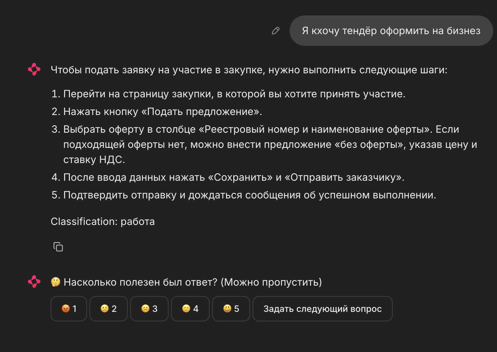
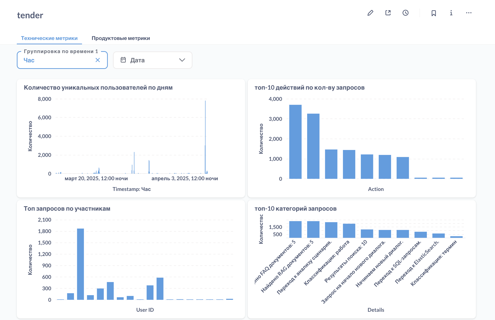
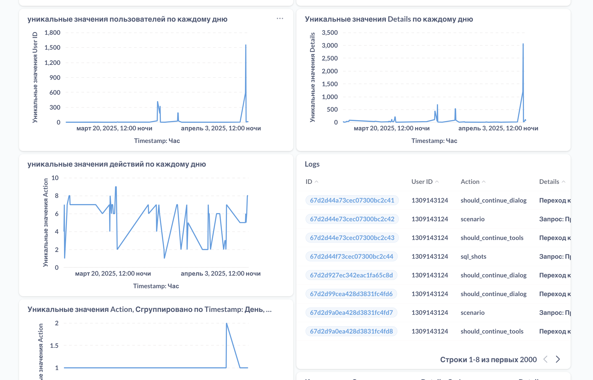
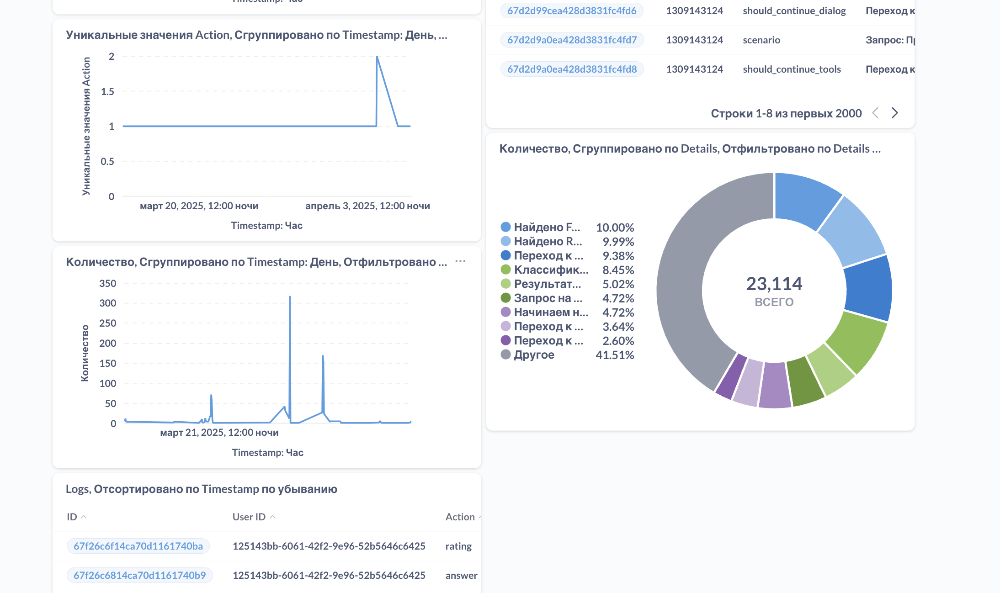

<p align="center">
  
</p>


# 🧾 SupplierAssistant — интеллектуальный бот для Портала поставщиков


**[SupplierAssistant](http://83.143.66.64:27363/)** — Telegram-бот на базе LLM (Large Language Model), разработанный для ответов на вопросы пользователей, связанные с информацией о **Портале поставщиков** — интернет-ресурсе, предназначенном для автоматизации деятельности заказчиков и поставщиков, оперативного заключения сделок и повышения прозрачности контрактных отношений.

**Попробовать наше решение можно [тут](http://83.143.66.64:27363/)!**

---

## 🚀 Возможности

- 🤖 Ответы на естественном языке по структуре, функциям и правилам работы Портала поставщиков  
- 📄 Объяснение процедур закупок, участия в тендерах и заключения контрактов  
- 🏢 Поддержка как для заказчиков, так и для поставщиков  
- 📌 Навигация по нормативной базе, регламентам и техническим требованиям  
- 🔍 Использование RAG (retrieval-augmented generation) для точных и актуальных ответов  

---

## 💡 Пример диалога

**Запрос от пользователя** 



**Оценивание ответа** 


---

## 🛠️ Технологии

- [Python 3.12.2](https://www.python.org/)
- [Poetry](https://python-poetry.org/)
- LLM (OpenAI / Mistral / Llama)
- Retrieval-Augmented Generation (RAG)

---

## 📦 Установка

```bash
git clone https://github.com/your-org/SupplierAssistant.git
cd SupplierAssistant
poetry install
```

---

## 🐳 Запуск через Docker

### 1. Соберите Docker-образ:

```bash
docker build -t supplier-assistant .
```

### 2. Запустите контейнер:

```bash
docker run -d \
  --name supplier-bot \
  --gpus all \
  --env-file .env \
  -v $(pwd)/data:/app/data \
  supplier-assistant
```

## 📊 Запуск аналитической платформы Metabase

Для удобного анализа логов и построения дашбордов можно использовать [Metabase](https://www.metabase.com/).

### 📁 Конфигурация

Файл `src/analytics_platform/docker-compose.yml` содержит готовую конфигурацию:

```yaml
version: '3.7'

services:
  metabase:
    image: metabase/metabase:latest
    container_name: metabase
    restart: always
    ports:
      - '27362:3000'
    environment:
      MB_DB_FILE: /metabase-data/metabase.db
    volumes:
      - metabase_data:/metabase-data

volumes:
  metabase_data:
```

### ▶️ Запуск Metabase

```bash
cd src/analytics_platform
docker-compose up -d
```

После запуска Metabase будет доступен по адресу:  
[http://localhost:27362](http://localhost:27362) или внешне: `http://<ваш-ip>:27362`

---

## Пример аналитики из дашборда








## 📞 Обратная связь

Если вы нашли ошибку или хотите предложить улучшение — создайте issue или отправьте pull request.  
Для сотрудничества и внедрения в корпоративную инфраструктуру — свяжитесь с разработчиком.
